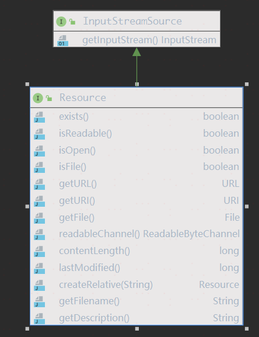

# Bean 定义文件的解析

## 初始化工厂

```java
// 1. 初始化一个bean 工厂
DefaultListableBeanFactory factory = new DefaultListableBeanFactory();
// 2. 初始化XmlBeanDefinitionReader,负责从xml文件中读取bean定义
XmlBeanDefinitionReader reader = new XmlBeanDefinitionReader(factory);
// 3. 加载bean 定义的入口方法
reader.loadBeanDefinitions("classpath:app.xml");
```

上述代码使用起来很简单，创建一个工厂和阅读器，传入配置文件的位置。

我们可以考虑一下，这些代码做了什么。

1. XmlBeanDefinitionReader 是如何定位配置文件的?
2. 如何解析配置文件的？
3. XmlBeanDefinitionReader的构造函数传入了一个BeanDefinitionRegistry对象，这个对象是用来注册bean定义的，那么是如何注册的呢？

## ResourceLoader 定位资源文件

### Resource

Spring将各种资源统一抽象为`Resource`,并使用`ResourceLoader`来定位`Resource`。如果资源以物理形式存在，那么它可以为每个资源打开一个InputStream，但是URL或文件句柄只能由某些特定资源返回。实际的行为取决于实现类。

#### `Resource`的结构



- boolean exists()：确定此资源是实际物理存在。此方法执行确定的存在性检查，而资源句柄的存在仅保证有效的描述符句柄。
- boolean isReadable()：指示是否可以通过`getInputStream()`读取此资源的非空内容。对于存在的典型资源描述符会返回`true`，因为从5.1开始它严格地暗示了`exist()`语义。请注意，在尝试读取实际内容时仍然可能失败。但是，如果返回值为`false`，则表示资源内容无法读取。
- boolean isOpen(): 指示此资源是否表示具有打开流的句柄。如果为`true`，则不能多次读取InputStream，必须读取并关闭该资源，以避免资源泄漏。对于典型的资源描述符将为false。
- boolean isFile()：确定此资源是否表示文件系统中的文件。返回`true`标志着(但不保证)`getFile()`将调用成功。
这在默认情况下返回`false`.
- URL getURL(): 返回此资源的URL句柄。
- URI getURI(): 返回此资源的URI句柄。
- File getFile(): 返回此资源的文件句柄。如果资源不能被解析为绝对文件路径，也就是说，如果资源在文件系统中不可用将抛出`FileNotFoundException`异常。
- ReadableByteChannel readableChannel()：返回一个`ReadableByteChannel`。希望每次调用都创建一个新的通道。
默认实现返回`Channels.newChannel(getInputStream())`。
- long contentLength()：确定此资源的内容长度。
- long lastModified()：确定此资源最后修改的时间戳。
- Resource createRelative(String relativePath)：创建与此资源相对路径的资源。
- String getFilename()：确定此资源的文件名，通常是路径的最后一部分:例如，“myfile.txt”。如果此类资源没有文件名，则返回`null`。
- String getDescription(): 返回此资源的描述，用于处理该资源时的错误输出。实现类可以从它们的`toString`方法返回这个值。

#### 常用的`Resource`实现类

1. ClassPathResource
类路径资源的实现类。使用给定的类加载器或给定的类来加载资源。如果类路径资源驻留在文件系统中，而不是JAR中的资源，则支持`java.io.File`方式来加载。该类始终支持URL方式来加载。

