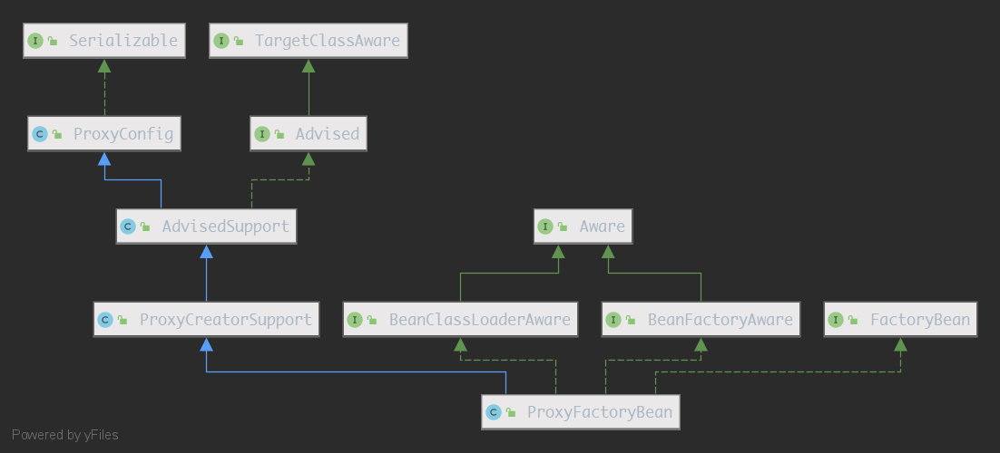

# Spring AOP 用法

前面讲到了AOP相关的思想和基本概念，实现方式可分为静态编绎型和代理两种方式。前者的代表作是`AspectJ`，在编绎阶段将通知织入到class中，需要用到特殊的工具来编绎。`AspectJ`定义了一种表达式语言来定义连接点，Spring 默认是基于JDK动态代理来实现AOP，并且只支持方法作为切入点。

## 如何使用

Spring 自己实现了一套AOP，使用起来不是太方便。还支持`AspectJ`，不过不完全支持。两种方式都可以使用编程式和xml配置方式。

使用Spring AOP大概有以下几种方式：

1. 在xml中配置`ProxyFactoryBean`，显式地设置advisors, advice, target等，或以编程方式使用`ProxyFactory`。Spring支持通过 jdk 动态代理和 cglib 来生成代理对象。前者只支持接口，后者可以支持类。
2. 配置`AutoProxyCreator`，这种方式下，还是如以前一样使用定义的bean，但是从容器中获得的其实已经是代理对象
3. 通过`<aop:config>`来配置，使用`AspectJ`的语法来定义切入点
4. 通过`<aop:aspectj-autoproxy>`来配置，使用`AspectJ`的注解来标识通知及切入点

### xml 配置 ProxyFactoryBean

1. 创建通知

   这里以前置通知类型为例。

   ```java
   public class UserBeforeAdvice implements MethodBeforeAdvice {
       @Override
       public void before(Method method, Object[] args, Object target) throws Throwable {
           System.out.println("Before method advice");
       }
   }
   ```

2. 创建业务代码

   ```java
   //接口
   public interface IBusinessService {
       String sayHello();
   }
   
   //实现类
   public class BusinessService implements IBusinessService{
       @Override
       public String sayHello(){
           System.out.println("hello");
           return "hello";
       }
   }
   ```

3. 配置代理类

   ```xml
   <!--业务实现-->
   <bean class="cn.sexycode.spring.study.chapter5.BusinessService" id="businessService"/>
   <!--通知实现-->
   <bean class="cn.sexycode.spring.study.chapter5.BusinessBeforeAdvice" id="userBeforeAdvice"/>
   <bean class="org.springframework.aop.framework.ProxyFactoryBean" id="businessProxy">
       <!--代理的接口-->
       <property name="interfaces" value="cn.sexycode.spring.study.chapter5.IBusinessService"/>
       <!--目标对象-->
       <property name="target" ref="businessService"/>
       <!--要应用的通知实现-->
       <property name="interceptorNames" value="userBeforeAdvice"/>
   </bean>
   ```

   1. 配置需要代理的接口，配置了此属性，将会使用Jdk 动态代理生成代理对象
   2. 需要代理的目标对象，即我们的业务对象
   3. 使用的通知bean名称`interceptorNames`，是个数组。如果不配置`targetName`/`target`/`targetSource`属性，数组的最后一个可以是目标对象的名字。这个属性还支持通配符`*`，如：`userBeforeAdvice*`，代表所有以`userBeforeAdvice`开头的bean都会成为通知。但是如果目标对象的名字出现在这个属性时，通配符不能是最后一个。

   经过上面的配置，已经将通知织入到代理对象中了，下面直接获取生成的代理对象，再调用方法即可以看到织入的结果。

4. 获取代理对象

   ```java
   DefaultListableBeanFactory beanFactory = new DefaultListableBeanFactory();
   XmlBeanDefinitionReader xmlBeanDefinitionReader = new XmlBeanDefinitionReader(beanFactory);
   xmlBeanDefinitionReader.loadBeanDefinitions("AopXmlSimpleConfig.xml");
   //获取代理对象
   ((IBusinessService) beanFactory.getBean("businessProxy")).sayHello();
   ```

   这里要注意的是要直接获取代理对象，然后转成我们的接口类型，再调用方法即可。

   输出结果：

   ```
   //打印的是通知的内容
   Before method advice
   //业务代码
   hello
   ```

   

## 实现方式

这种方式其实跟《AOP的基本概念》一文开头描述的思想类似，为每个业务实现类创建代理对象，只不过这里的织入时机已经可以配置了。

那么Spring 是如何生成代理对象的？又是如何织入通知的？

可以想象一下，在获取bean的时候，初始化所有的通知，并创建代理类，在调用代理对象的方法时调用通知的代码和原对象的方法。

看一下该类的类图：



`ProxyFactoryBean`类实现了`FactoryBean`接口。也就是说最终会通过`getObject`方法返回生成的对象。`ProxyConfig`类提供了一些代理对象的配置项，可以确保所有的代理创建器都具有一致的属性。`AdvisedSupport`类管理通知和切面，不提供实际的创建代理的方法，由它的子类去实现。`ProxyCreatorSupport`是代理工厂的基类，提供创建代理对象的公共操作，内部使用可配置的`AopProxyFactory`代理工厂来创建代理，默认的`AopProxyFactory`工厂实现根据情况创建`JdkDynamicAopProxy`或者`JdkDynamicAopProxy`代理。

### getObject 方法

前面讲到了，当Spring初始化此bean时，最终会调用`getObject`方法返回实际的bean。

```java
public Object getObject() throws BeansException {
		initializeAdvisorChain();
		if (isSingleton()) {
			return getSingletonInstance();
		}
		else {
			if (this.targetName == null) {
				logger.info("Using non-singleton proxies with singleton targets is often undesirable. " +
						"Enable prototype proxies by setting the 'targetName' property.");
			}
			return newPrototypeInstance();
		}
	}
```

#### 初始化通知链

第一步就是初始化切面链，配置此代理时，可以应用多个切面，所以最终会形成一个调用链。如果此bean是单例的，则会创建单例对象。

初始化方法`initializeAdvisorChain()`是一个线程同步的方法，方法声明上加了`synchronized`关键字。

初始化切面链时，如果之前已经初始化过，将不会再次初始化。初始化时会遍历所有配置的通知，如果是通配符`*`，则会根据类型`Advisor`和`Interceptor`查找所有的bean，并排序，再判断bean的名称是否匹配前缀，是则认为是一个通知，会将其加入到通知链中。如果不是通配符，再判断该bean或者此代理工厂bean是否单例，是的话则会在`BeanFactory`中查找该bean，加入到链中。不是单例则需要将该通知先记录下来，等到最后创建代理对象时，再创建该通知对象。这里为什么需要这样判断是不是单例？这样可以避免在初始化通知链时创建原型对象，这个时候还不需要初化原型通知对象，在最终使用到此对象时再初始化即可。

在添加通知时，由于`intercepterNames`中即可以是`Advice`也可以是`Advisor`，或者是其他自定义的通知类型（实现`Advice`接口），所以需要将通知转换成`Advisor`(可以理解为切面)。如果本身就是`Advisor`，则不需要转换。如果是`Advice`，并且是支持通知类型，则转换成`DefaultPointcutAdvisor`。转换时通过适配器`AdvisorAdapter`来判断是否支持该通知。`ProxyFactoryBean`默认使用`GlobalAdvisorAdapterRegistry.getInstance()`方式获取到默认的适配器注册器，可以替换该注册器，添加自定义的适配器。也可以注册`AdvisorAdapterRegistrationManager`，然后注册实现`AdvisorAdapter`的bean，该后处理器会自动注册自定义的适配器。Spring 默认注册了`MethodBeforeAdviceAdapter`、`AfterReturningAdviceAdapter`、`ThrowsAdviceAdapter`三个适配器。通过适配器最终可以将基于`AspectJ`的通知转换成Spring 的`Advisor`，达到设计上的统一。

#### 单例代理对象

到这一步，初始化通知链完毕，根据`isSingleton()`方法决定是返回单例对象还是原型对象。需要返回单例代理对象时，则需要在这一步中创建。

如果之前已经创建过了，则直接返回缓存的单例对象。

如果没有创建过，则需要创建代理对象。

1. 刷新目标对象，从`BeanFactory`中获取到实际的目标对象。并封装成`TargetSource`。

2. 在自动检测接口模式（未指定代理接口里默认为`true`，如果没有指定接口时，将此值设置为`false`来使用cglib创建代理对象）、代理接口未指定、不是代理目标对象的情况下，将获取到目标对象所有的接口，并代理所有接口。

3. 准备工作做完了，接下来就是创建代理对象了。创建之前先激活`AdvisedSupportListener`监听器。这里由默认的`AopProxyFactory`工厂指定了两种创建代理对象的方式，根据情况使用jdk动态代理方式还是cglib方式。满足以下情况时：将使用cglib代理。1). 优化代理，2). 直接代理目标对象，3). 用户没有指定代理接口。在上面提到的3点中，如果代理目标类是接口，或者是jdk代理，则还是会使用jdk代理方式。

   ```java
   public AopProxy createAopProxy(AdvisedSupport config) throws AopConfigException {
       if (config.isOptimize() || config.isProxyTargetClass() || hasNoUserSuppliedProxyInterfaces(config)) {
           Class<?> targetClass = config.getTargetClass();
           if (targetClass == null) {
               throw new AopConfigException("TargetSource cannot determine target class: " +
                                            "Either an interface or a target is required for proxy creation.");
           }
           if (targetClass.isInterface() || Proxy.isProxyClass(targetClass)) {
               return new JdkDynamicAopProxy(config);
           }
           return new ObjenesisCglibAopProxy(config);
       }
       else {
           return new JdkDynamicAopProxy(config);
       }
   }
   ```

4. 确定代理方式之后，就是使用对应的方式去创建代理对象了。jdk方式使用`JdkDynamicAopProxy`对象来最终生成代理对象，cglib使用`ObjenesisCglibAopProxy`对象。

#### JDK代理对象

使用jdk代理生成代理对象时，会先确定完整的接口。在原有接口基础上会新加入`SpringProxy`，`Advised`，`DecoratingProxy`接口。创建代理时会将自己作为`InvocationHandler`传进去，`JdkDynamicAopProxy`实现了`InvocationHandler`接口，最终调用代理对象的方法时会执行该接口的方法。

##### invoke方法

`JdkDynamicAopProxy`实现了`InvocationHandler`接口，也就是说当代理对象的方法被调用时，`JdkDynamicAopProxy`的`invoke`方法将会被调用，从而通过`invoke`的实现逻辑完成对目标方法调用的拦截。

主要的逻辑是`equals`，`hashCode`方法的判断，`Advised`和`DecoratingProxy`接口的判断。这些方法需要特殊处理，如果目标类没有实现`equals`，`hashCode`方法，那么需要去比较原始对象。

接下来需要根据当前调用的方法获取到对应的通知链，如果通知链为空，则表示当前方法不需要拦截，直接调用目标对象的方法就可以了。如果不为空，则表示需要拦截，生成`ReflectiveMethodInvocation`对象，该对象封装了拦截器的调用过程。

###### 获取通知链

获取调用方法的通知链，目标对象所有的通知，之前已经初始化过了，但是每个方法所需要的不一样，所以这一步还需要根据方法进行过滤。具体逻辑在`AdvisedSupport.getInterceptorsAndDynamicInterceptionAdvice()`方法中，会将结果缓存下来下次直接使用。

```java
public List<Object> getInterceptorsAndDynamicInterceptionAdvice(Method method, @Nullable Class<?> targetClass) {
    MethodCacheKey cacheKey = new MethodCacheKey(method);
    List<Object> cached = this.methodCache.get(cacheKey);
    if (cached == null) {
        cached = this.advisorChainFactory.getInterceptorsAndDynamicInterceptionAdvice(
            this, method, targetClass);
        this.methodCache.put(cacheKey, cached);
    }
    return cached;
}
```

`AdvisedSupport`通过`AdvisorChainFactory`(默认使用`DefaultAdvisorChainFactory`)创建一个拦截链，针对每个已经注册的`Advisor`，如果是`PointcutAdvisor`，获取到对应的`Pointcut`，再得到其`ClassFilter`，检查是否匹配目标类型，类型检查通过之后再得到`MethodMatcher`进行方法匹配。*在获取拦截链阶段，不过滤方法参数*。

